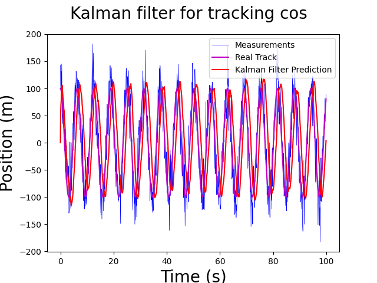
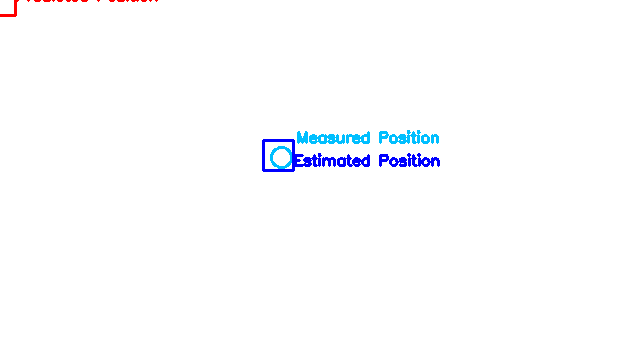

# KalmanFilter in numpy

including linear and image object tracking

## Run linear
```
python linear_KalmanFilter.py
```


## Run tracking
```
python objTracking.py
```


## Reference
[https://github.com/RahmadSadli/Kalman-Filter](https://github.com/RahmadSadli/Kalman-Filter)

[https://github.com/RahmadSadli/2-D-Kalman-Filter](https://github.com/RahmadSadli/2-D-Kalman-Filter)